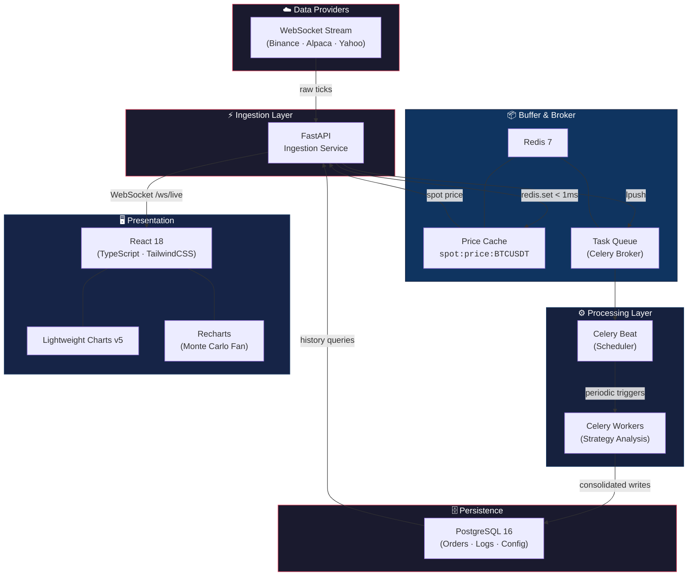
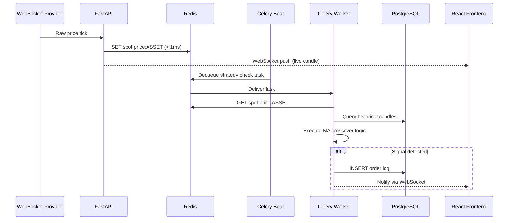
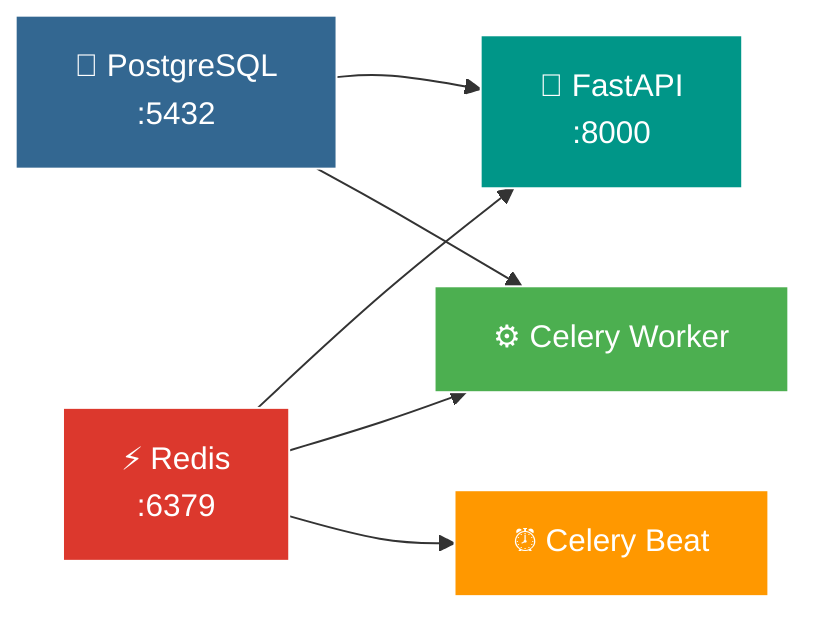
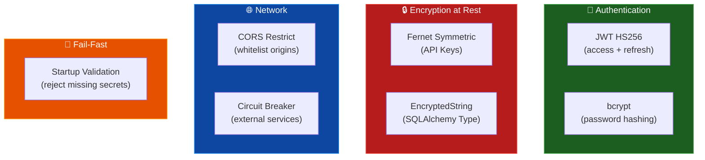

<div align="center">

# 📈 Moody

**Plataforma de Swing Trade Automatizado com Análise Quantitativa**

[](https://github.com/soneylegal/moody/actions/workflows/ci.yml)
[](https://render.com)
[](https://www.python.org/)
[](https://fastapi.tiangolo.com/)
[](https://react.dev/)
[](https://www.typescriptlang.org/)
[](https://www.postgresql.org/)
[](https://redis.io/)
[](#)

---

**Backtesting · Monte Carlo · Paper Trading · Real-time Streaming**

</div>

## Visão Geral

Moody é uma plataforma full-stack de automação de swing trade projetada para baixa latência e alta resiliência. Combina execução assíncrona de estratégias, backtesting quantitativo, simulação estocástica de Monte Carlo e paper trading em tempo real, tudo orquestrado sobre uma arquitetura distribuída de microsserviços.

### Principais Funcionalidades

- 🕯️ **Gráficos de velas em tempo real** via WebSocket + Lightweight Charts v5
- 📊 **Backtesting engine** com cruzamento de médias móveis e métricas de performance
- 🎲 **Simulação de Monte Carlo** com fan chart percentílico (P5, P25, P50, P75, P95)
- 💹 **Paper Trading** com saldo simulado, PnL flutuante e histórico de ordens
- 🔐 **Segurança enterprise** — JWT, Fernet encryption at rest, CORS restrito
- ⚡ **Processamento assíncrono** — Celery workers desacoplados do request/response
- 🛡️ **Resiliência** — Circuit breaker, fault injection e chaos testing
- 📡 **Observabilidade** — OpenTelemetry com tracing distribuído

---

## Arquitetura



### Fluxo de Dados



---

## Stack Tecnológica

| Camada | Tecnologias | Propósito |
|--------|------------|-----------|
| **Frontend** | React 18 · TypeScript · TailwindCSS · Lightweight Charts v5 · Recharts | SPA com gráficos interativos em tempo real |
| **API Gateway** | FastAPI · Pydantic v2 · Uvicorn | REST + WebSocket, validação e serialização |
| **Async Processing** | Celery · Redis (broker) | Workers desacoplados para análise de estratégias |
| **Cache** | Redis 7 (cache) | Price cache sub-millisecond para spot prices |
| **Persistence** | PostgreSQL 16 · SQLAlchemy 2 | Ordens, logs, configurações e candles consolidados |
| **Auth & Security** | JWT (HS256) · Fernet · bcrypt | Autenticação stateless com encryption at rest |
| **Observability** | OpenTelemetry SDK | Tracing distribuído e métricas customizadas |
| **Resilience** | Circuit Breaker · Chaos Toolkit | Tolerância a falhas em serviços externos |
| **CI/CD** | GitHub Actions · Docker Compose | Pipeline automatizada com PostgreSQL service |

---

## Estrutura do Projeto

```
moody/
├── backend/                        # Microsserviço API + Workers
│   ├── app/
│   │   ├── main.py                 # FastAPI app, CORS, WebSocket, routers
│   │   ├── config.py               # Environment config (fail-fast on missing secrets)
│   │   ├── models.py               # SQLAlchemy ORM + EncryptedString type
│   │   ├── schemas.py              # Pydantic request/response schemas
│   │   ├── security.py             # JWT token creation and validation
│   │   ├── db.py                   # Database engine and session factory
│   │   ├── deps.py                 # FastAPI dependency injection
│   │   ├── tasks.py                # Celery app, beat schedule, worker tasks
│   │   ├── services_bot.py         # Trading bot strategy execution
│   │   ├── services_backtest.py    # Historical backtesting engine
│   │   ├── services_montecarlo.py  # Monte Carlo risk simulation
│   │   ├── services_exchange.py    # Exchange integration (ccxt + Redis cache)
│   │   ├── services_stream.py      # WebSocket market data streaming
│   │   ├── circuit_breaker.py      # Circuit breaker for external services
│   │   ├── middleware_fault.py     # Fault injection middleware (testing)
│   │   ├── telemetry.py            # OpenTelemetry instrumentation
│   │   ├── core_unified.py         # Unified business logic module
│   │   ├── asset_universe.py       # Supported asset definitions
│   │   └── routers/                # REST endpoint modules
│   ├── tests/                      # pytest suite (26+ tests)
│   │   ├── conftest.py             # Shared fixtures and test DB
│   │   ├── test_auth.py            # Authentication flow tests
│   │   ├── test_backtest.py        # Backtesting logic tests
│   │   ├── test_montecarlo.py      # Monte Carlo simulation tests
│   │   ├── test_circuit_breaker.py # Circuit breaker behavior tests
│   │   ├── test_fault_injection.py # Fault middleware tests
│   │   └── test_health.py          # Health endpoint tests
│   ├── Dockerfile
│   └── pyproject.toml              # Dependencies and project metadata
│
├── web/                            # Frontend SPA
│   ├── src/
│   │   ├── components/
│   │   │   ├── LiveChart.tsx        # Real-time candlestick chart
│   │   │   ├── FanChart.tsx         # Monte Carlo percentile fan chart
│   │   │   ├── MetricCard.tsx       # Glassmorphic metric cards
│   │   │   └── Layout.tsx           # App shell with sidebar navigation
│   │   ├── pages/
│   │   │   ├── Dashboard.tsx        # Paper trading dashboard
│   │   │   ├── Strategy.tsx         # MA crossover strategy config
│   │   │   ├── Backtest.tsx         # Backtesting + Monte Carlo view
│   │   │   ├── Login.tsx            # Authentication page
│   │   │   └── Register.tsx         # Registration page
│   │   └── services/
│   │       └── ApiService.ts        # HTTP client + WebSocket manager
│   ├── package.json
│   ├── tailwind.config.js
│   └── tsconfig.json
│
├── chaos/                          # Chaos Engineering experiments
│   ├── experiment-api-down.yaml
│   ├── experiment-db-timeout.yaml
│   └── experiment-exchange-unavailable.yaml
│
├── db/
│   └── schema.sql                  # PostgreSQL bootstrap schema
│
├── .github/workflows/
│   └── ci.yml                      # CI pipeline (lint + test + coverage)
│
└── docker-compose.yml              # Full stack orchestration (5 services)
```

---

## Início Rápido

### Pré-requisitos

| Ferramenta | Versão | Obrigatório |
|-----------|--------|-------------|
| Docker + Compose | 24+ | ✅ |
| Node.js | 18+ | Para dev frontend |
| Python | 3.12+ | Para dev backend |

### 1. Configure os segredos

```bash
# Gere chaves seguras (obrigatório antes do primeiro boot)
export JWT_SECRET_KEY=$(python3 -c "import secrets; print(secrets.token_urlsafe(64))")
export FIELD_ENCRYPTION_KEY=$(python3 -c "from cryptography.fernet import Fernet; print(Fernet.generate_key().decode())")
```

### 2. Suba a stack completa

```bash
docker compose up --build -d
```

Isso inicializa **5 serviços** orquestrados:



### 3. Acesse os serviços

| Serviço | URL |
|---------|-----|
| 🚀 API REST | [`http://localhost:8000`](http://localhost:8000) |
| 📖 Swagger UI | [`http://localhost:8000/docs`](http://localhost:8000/docs) |
| 📡 WebSocket | `ws://localhost:8000/ws/market/{ASSET}` |
| 🖥️ Frontend | [`http://localhost:3000`](http://localhost:3000) |
| 🐘 PostgreSQL | `localhost:5432` |
| ⚡ Redis | `localhost:6379` |

### Reset completo

```bash
docker compose down -v && docker compose up --build -d
```

---

## Desenvolvimento Local

<details>
<summary><strong>Backend (FastAPI)</strong></summary>

```bash
cd backend
cp .env.example .env          # Configure DATABASE_URL, REDIS_URL e segredos

pip install -e ".[dev]"       # Instale com dependências de desenvolvimento
uvicorn app.main:app --reload --port 8000
```

</details>

<details>
<summary><strong>Frontend (React)</strong></summary>

```bash
cd web
npm install
npm start                     # http://localhost:3000
```

</details>

<details>
<summary><strong>Celery Workers</strong></summary>

```bash
cd backend

# Worker (processa tarefas da fila)
celery -A app.tasks worker --loglevel=info

# Beat (dispara tarefas periódicas)
celery -A app.tasks beat --loglevel=info
```

</details>

---

## API Reference

### Autenticação

| Método | Endpoint | Descrição |
|--------|----------|-----------|
| `POST` | `/auth/register` | Criar conta |
| `POST` | `/auth/login` | Obter access + refresh token |
| `POST` | `/auth/refresh` | Renovar access token |
| `GET` | `/auth/me` | Dados do usuário autenticado |

### Endpoints Protegidos

Todas as rotas abaixo requerem header `Authorization: Bearer <token>`.

| Domínio | Endpoints | Descrição |
|---------|-----------|-----------|
| **Dashboard** | `GET /dashboard/*` | Saldo, PnL flutuante, ordens recentes |
| **Strategy** | `GET/PUT /strategy/*` | Configuração de ativo, timeframe e MAs |
| **Backtest** | `POST /backtest/run` | Executar backtesting com pandas |
| **Monte Carlo** | `POST /montecarlo/simulate` | Simulação de risco (N caminhos) |
| **Paper Trading** | `POST /paper/*` | Buy/Sell simulado com posições |
| **Exchange** | `GET/POST /exchange/*` | Integração paper/live via ccxt |
| **WebSocket** | `ws://host/ws/market/{ASSET}` | Stream de preços em tempo real |

---

## Segurança



| Mecanismo | Implementação | Proteção |
|-----------|---------------|----------|
| **JWT Auth** | `HS256`, access (2h) + refresh (7d) | Autenticação stateless |
| **Fernet Encryption** | `EncryptedString` TypeDecorator | API keys encriptadas no banco |
| **bcrypt** | Hashing de senhas com salt | Proteção contra rainbow tables |
| **CORS** | Whitelist via `CORS_ORIGINS` | Bloqueio de origens não autorizadas |
| **Circuit Breaker** | Padrão de resiliência | Proteção contra cascading failures |
| **Fail-Fast Startup** | `sys.exit(1)` se secrets ausentes | Impede boot inseguro |

---

## Testes e Qualidade

### Suite de Testes

```bash
cd backend
pytest tests/ -v --tb=short --cov=app --cov-report=term-missing
```

| Módulo | Testes | Cobertura |
|--------|--------|-----------|
| `test_auth.py` | Registro, login, refresh, proteção de rotas | Auth flow completo |
| `test_backtest.py` | Execução de backtest, validação de métricas | Engine de backtesting |
| `test_montecarlo.py` | Simulação de caminhos, distribuição percentil | Risk analysis |
| `test_circuit_breaker.py` | Estado aberto/fechado/half-open, thresholds | Resiliência |
| `test_fault_injection.py` | Middleware de injeção de falhas | Chaos engineering |
| `test_health.py` | Health check endpoint | Liveness probe |

### Chaos Engineering

Experimentos de resiliência com [Chaos Toolkit](https://chaostoolkit.org/) para validar o comportamento do sistema sob falhas controladas:

```bash
# API indisponível — testa graceful degradation
chaos run chaos/experiment-api-down.yaml

# Timeout de banco — testa circuit breaker do PostgreSQL
chaos run chaos/experiment-db-timeout.yaml

# Exchange offline — testa fallback do serviço de preços
chaos run chaos/experiment-exchange-unavailable.yaml
```

### CI/CD Pipeline


A pipeline CI roda automaticamente em push para `main` e `feature/*`, e em pull requests para `main`. Utiliza PostgreSQL 16 como service container para testes de integração.

---

## Variáveis de Ambiente

| Variável | Obrigatório | Default | Descrição |
|----------|:-----------:|---------|-----------|
| `DATABASE_URL` | ✅ | — | Connection string PostgreSQL (`postgresql+psycopg://...`) |
| `REDIS_URL` | ✅ | — | URL do Redis para cache e broker (`redis://...`) |
| `JWT_SECRET_KEY` | ✅ | — | Secret para assinatura JWT (mín. 64 chars) |
| `FIELD_ENCRYPTION_KEY` | ✅ | — | Chave Fernet para encriptação de API keys |
| `CORS_ORIGINS` | ❌ | `localhost:*` | Origens permitidas (separadas por vírgula) |
| `MARKET_STREAM_INTERVAL_SECONDS` | ❌ | `2.0` | Intervalo do stream de preço em segundos |
| `JWT_ALGORITHM` | ❌ | `HS256` | Algoritmo de assinatura JWT |
| `JWT_EXPIRE_MINUTES` | ❌ | `120` | Tempo de expiração do access token |
| `JWT_REFRESH_EXPIRE_MINUTES` | ❌ | `10080` | Tempo de expiração do refresh token (7 dias) |

> **⚠️ Atenção:** A aplicação encerra imediatamente (`sys.exit(1)`) se `JWT_SECRET_KEY` estiver ausente ou configurada como `change-me-in-production`. Esse comportamento é intencional para prevenir deploys inseguros.

---

## Deploy

### Render (Recomendado)

O deploy usa **Render Blueprint** — basta conectar o repositório que o Render lê o `render.yaml` e provisiona tudo automaticamente.

#### Setup via Blueprint (automático)

1. No [Dashboard da Render](https://dashboard.render.com), clique em **New + → Blueprint**
2. Conecte o repositório `soneylegal/moody`
3. O Render detecta o `render.yaml` e cria automaticamente:
   - **Web Service** (`moody-api`) — Docker, porta 8000
   - **PostgreSQL** (`moody-db`) — Free tier
   - **Redis** (`moody-redis`) — Free tier
4. As variáveis `JWT_SECRET_KEY` e `FIELD_ENCRYPTION_KEY` são geradas automaticamente
5. Após o deploy, o Web Service estará disponível em `https://moody-api.onrender.com`

#### Setup manual (alternativa)

1. Crie um banco **PostgreSQL** no Render → copie a **Internal Database URL**
2. Crie um serviço **Redis** no Render → copie a **Internal Redis URL**
3. Crie um **Web Service** (Docker) apontando para o repositório:
   - **Branch:** `main` · **Root Directory:** (raiz)
   - **Dockerfile:** `backend/Dockerfile`
4. Configure as environment variables:

```env
DATABASE_URL=<Internal Database URL>
REDIS_URL=<Internal Redis URL>
JWT_SECRET_KEY=<gere com: python3 -c "import secrets; print(secrets.token_urlsafe(64))">
FIELD_ENCRYPTION_KEY=<gere com: python3 -c "from cryptography.fernet import Fernet; print(Fernet.generate_key().decode())">
CORS_ORIGINS=https://moody-api.onrender.com
```

#### Endpoints em produção

| Recurso | URL |
|---------|-----|
| Interface Web | `https://<app>.onrender.com/` |
| Swagger | `https://<app>.onrender.com/docs` |
| Health Check | `https://<app>.onrender.com/health` |

---

<div align="center">

**Moody** · Feito com ☕ e 📈

</div>
